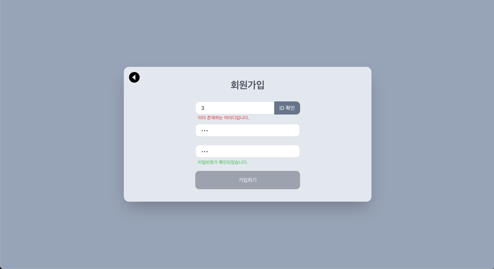

# WebSocket, WebRTC를 활용한 3인 화상통화 / 채팅 웹앱 개발

## 1. 배포

배포 주소: https://chattingroom.mooo.com/

### 1-1. 배포 과정

> FE 배포: `NginX`

- 서빙 폴더: `/var/www/webrtc_chattingroom`

> BE 배포: `Docker compose` 12000번 포트 + `NginX`

NginX 구성 파일

```shell
server {
      server_name chattingroom.mooo.com;
      root /var/www/webrtc_chattingroom;
      index index.html;

      location / {
        try_files $uri /index.html;
        proxy_http_version 1.1;
        proxy_set_header Upgrade $http_upgrade;
        proxy_set_header Connection "Upgrade";
        proxy_set_header Host $host;
      }

      location /socket.io/ {
        proxy_pass http://127.0.0.1:12000;
        proxy_http_version 1.1;
        proxy_set_header Upgrade $http_upgrade;
        proxy_set_header Connection "Upgrade";
        proxy_set_header Host $host;
      }

      location /api/ {
        rewrite ^/api(.*) $1 break;
        proxy_pass http://127.0.0.1:12000;
        proxy_set_header X-Real-IP $remote_addr;
        proxy_set_header X-Forwarded-For $proxy_add_x_forwarded_for;
        proxy_set_header X-Forwarded-Proto $scheme;
        proxy_http_version 1.1;
        proxy_set_header Upgrade $http_upgrade;
        proxy_set_header Connection "Upgrade";
        proxy_set_header Host $host;
      }
}
```

---

## 2. 소개

### 2-1. 랜딩 페이지


초기 접속 화면입니다. 로그인 / 회원가입 버튼을 누를 수 있습니다.

만약 이미 로그인 된 상태에서 강제로 `/`, `/login`, `/register` 페이지에 접속하면, 자동으로 `/home`으로 이동됩니다.

---

### 2-2. 회원가입 페이지



아이디를 입력 후, ID 확인 버튼을 통해 아이디 중복 여부를 확인합니다.

다음으로 사용할 비밀번호를 두 번 입력합니다.

좌상단 버튼을 통해 랜딩 페이지로 이동할 수 있습니다.

중복 아이디가 존재하지 않고 비밀번호와 비밀번호 확인 입력이 일치하면, 가입하기 버튼이 활성화됩니다.

아이디 / 비밀번호 안내 메시지가 표시되는 순간 발생하는 **Reflow**를 없애기 위해서, 공백문자인 `"\u00A0"`(Non-Breaking Space)를 안내 메시지가 비어있을 때 렌더링했습니다. `<p>{idMsg || "\u00A0"}</p>`

---

### 2-3. 로그인 페이지


아이디와 비밀번호를 입력하고 로그인 버튼을 눌러 로그인 할 수 있습니다.

로그인에 성공하면 `/home`으로 이동합니다.

우측 하단 회원가입 하기 링크를 클릭하면 `/register`로 이동됩니다.

역시 좌상단 버튼을 통해 랜딩 페이지로 이동할 수 있습니다.

---

### 2-4. 홈 페이지

<div style="width: 800px; display: flex;">
  
  
</div>

접속 당시 열려 있는 채팅방이 있다면, 우측 이미지와 같이 방 이름과 인원 수, 입장 가능 여부가 나오게 되고, 클릭 시 해당 채팅방에 접속됩니다.

반대로 열려 있는 채팅방이 없다면, 좌측 이미지와 같이 안내가 나오게 됩니다.

채팅방 목록을 받아오는 기능은 소켓이 아닌 API를 통해 구현했습니다. 따라서 새로운 채팅방이 개설되도 자동으로 목록에 추가되지는 않고, 새로고침 버튼을 클릭해야 합니다.

> 채팅방 목록을 받아오는 기능을 API로 구현한 이유는 `/home`에서 만든 Socket 객체를 `/room`으로 이동하면서 유지하기 어려웠기 때문입니다.

채팅방 목록 아래의 input과 채팅방 만들기 버튼을 사용해서 새로운 채팅방을 개설할 수 있습니다.

---

### 2-5. 룸 페이지


상단에는 채팅방 이름이 나오고, 좌상단의 뒤로가기 버튼을 클릭해서 `/home` 으로 이동할 수 있습니다.

좌측에는 본인의 비디오가 나오게 되고, 중앙에는 상대방들의 비디오가 나오며, 우측에는 채팅창을 배치했습니다.

하단에는 비디오 비활성화 / 마이크 음소거 토글 버튼이 있고, 비디오 / 오디오 장치를 변경하는 드롭다운도 존재합니다.

---

## 3. Socket, Web RTC 코드

FE: `/frontend/src/hooks/useSocket.tsx`에 대부분 존재합니다.

BE: `/backend/socketHandler.js`에 모두 존재합니다.

## 4. 사용 기술 스택

**FE**:

- Build: `Vite`
- Language: `TypeScript`
- Framework: `React`
- Routing: `react-router-dom`
- Icon: `react-icons`
- CSS: `tailwindCSS`, `tailwind-scrollbar`
- Http: `axios`
- Websocket: `socket.io-client`
- Time formatting: `date-fns`

**BE**:

- Devtools: `nodemon`
- Language: `JavaScript`
- Framework: `express`
- Cors handling: `cors`
- Database: `mysql`
- Auth: `jsonwebtoken`
- Env: `dotenv`
- Websocket: `socket.io`

**Deploy**:

- FE: `NginX`
- BE: `Docker compose`
- Reverse Proxy: `nginx proxy manager`, `NginX`
